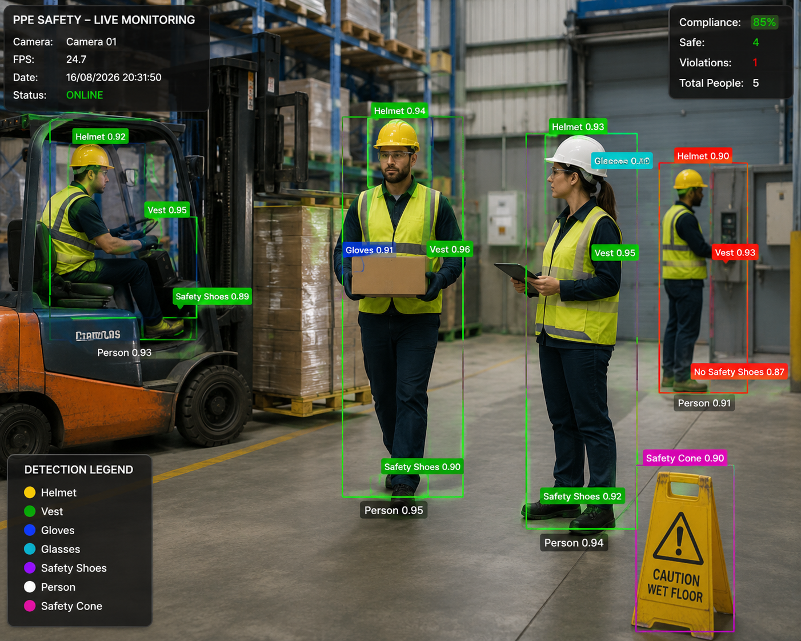

# PPE Safety AI Monitoring

<p align="center">
  <b>AI-powered Personal Protective Equipment detection and safety monitoring for industrial environments</b>
</p>

<p align="center">
  Computer Vision · YOLO · OpenCV · FastAPI · React
</p>

<p align="center">
  
</p>

---

## About the Project

**PPE Safety AI Monitoring** is an intelligent computer vision platform designed to support Health, Safety and Environment (HSE) monitoring in industrial environments.

The system analyzes camera streams using a YOLO-based object detection model to identify workers and Personal Protective Equipment (PPE), helping detect potential safety non-compliance in real time.

The project combines computer vision, real-time camera processing and a web-based monitoring interface into a single local application that can be operated without modifying the source code.

The platform is designed for environments such as industrial workshops, maintenance areas, production facilities, warehouses and other workplaces where PPE compliance is essential.

---

## Main Features

### Real-Time PPE Detection

The detection engine processes images and camera streams using a trained YOLO model.

The system can identify several safety-related classes, including:

- Person
- Helmet
- Safety Vest
- Gloves
- Safety Shoes
- Safety Glasses
- Mask
- Safety Cone
- Ladder
- Tools

Detection results include bounding boxes, predicted classes and confidence scores.

### Live Monitoring

The monitoring interface provides a centralized view of active cameras and real-time detections.

Operators can visualize:

- live camera streams;
- detected workers;
- detected PPE;
- confidence scores;
- PPE compliance information;
- safety violations;
- camera status;
- system status.

### Safety Alerts

Potential PPE violations can be displayed through the safety alert interface.

Alerts can contain information such as:

- violation type;
- camera;
- monitored zone;
- detection confidence;
- timestamp;
- severity;
- event status.

### Camera Management

The application includes a dedicated camera management interface designed to avoid manual source-code configuration.

The platform is being designed to support:

- integrated PC webcams;
- USB cameras;
- IP cameras;
- camera discovery;
- camera connection testing;
- camera preview;
- camera activation and deactivation;
- multiple monitoring sources.

### History and Analytics

The interface also provides dedicated sections for historical events and HSE indicators.

These components are intended to support the analysis of:

- PPE compliance rates;
- detected violations;
- violations by PPE category;
- violations by camera or monitored area;
- temporal trends;
- detection activity.

---

## System Architecture

The application is organized into three main components.

### Computer Vision

**YOLO + OpenCV**

OpenCV handles image and camera acquisition while the YOLO model performs PPE object detection.

### Backend

**Python + FastAPI**

The backend is responsible for the detection services, camera integration and communication with the web application.

### Frontend

**React-based web interface**

The frontend provides the HSE monitoring dashboard, live monitoring, alerts, history, analytics, camera configuration and system status.

---

## Technology Stack

| Component | Technology |
|---|---|
| Object Detection | YOLO |
| Computer Vision | OpenCV |
| AI Framework | Ultralytics |
| Backend | Python |
| API | FastAPI |
| Frontend | React / TypeScript |
| Styling | Tailwind CSS |
| Visualization | Recharts |
| Camera Processing | OpenCV VideoCapture |
| Deployment | Local Windows application |
| Version Control | Git / GitHub |

---

## Application Interface

The platform contains several dedicated modules.

### Dashboard

The main dashboard provides a global overview of the monitored environment, including PPE compliance, active cameras, detected people and safety violations.

### Live Monitoring

Displays active video sources and AI detections in real time.

### Safety Alerts

Centralizes detected PPE violations and safety events.

### History

Provides access to previous detections and monitoring events.

### Analytics

Displays safety indicators and PPE compliance statistics.

### Cameras

Provides a graphical interface for managing monitoring sources.

### System Status

Displays information about the detection engine, backend and connected services.

### Settings

Provides application configuration without requiring direct modification of the source code.

---

## Local Camera Testing

The application is designed to support testing with the integrated webcam of a Windows computer.

OpenCV accesses a local camera through a camera index such as:

```python
cv2.VideoCapture(0)
```

The target camera workflow from the web interface is:

**Camera Management → Detect Cameras → Camera 0 → Preview → Live Monitoring**

Camera status must reflect the actual state of the physical device. A camera should only be reported as `ONLINE` when the backend can successfully access it.

---

## Running the Application

The project includes a Windows startup script to simplify local execution.

From the project directory, run:

```text
START_APPLICATION.bat
```

The script is intended to start the required backend and frontend services and open the monitoring interface.

The frontend is configured to run locally on:

```text
http://localhost:6600
```

The frontend port was intentionally moved away from port `3000` to avoid conflicts with other local services.

To stop the application, use:

```text
STOP_APPLICATION.bat
```

---

## Project Structure

```text
FaceSense/
│
├── frontend/
│
├── models/
│
├── assets/
│
├── resultats_detection/
│
├── app_hse.py
├── detection_epi.py
├── ppe_detector.py
├── test_ppe_camera.py
├── test_fusion.py
├── START_APPLICATION.bat
├── STOP_APPLICATION.bat
└── README.md
```

The exact structure may evolve as the camera streaming and production integration components are finalized.

---

## AI Model

The PPE detection system uses a YOLO-based object detection model trained for industrial safety monitoring.

The project includes work on improving the training dataset through the combination of PPE datasets in order to improve the representation of safety equipment and difficult classes.

The trained weights are intentionally excluded from the Git repository when necessary because model checkpoints can be large.

A local model can be placed inside the appropriate `models/` directory.

---

## Model Output

For every detected object, the inference system can provide:

```text
Class
Confidence
Bounding box coordinates
```

Example:

```text
Person        0.96
Helmet        0.94
Safety Vest   0.91
Gloves        0.87
Safety Shoes  0.90
```

These results can then be displayed directly on the monitored video stream.

---

## Safety Monitoring Logic

The purpose of the platform is not limited to detecting objects independently.

The longer-term monitoring logic associates detected workers with required protective equipment in order to identify potentially compliant and non-compliant situations.

Examples include:

```text
Person + Helmet + Safety Vest → PPE compliant

Person + Helmet + Missing Safety Vest → Safety alert

Person + Missing Helmet → Safety alert
```

The exact compliance rules can be adapted according to the monitored industrial zone and its HSE requirements.

---

## Development Status

The project is under active development.

### Implemented

- YOLO PPE detection
- PPE dataset preparation and fusion
- Image-based inference
- Camera testing scripts
- Python detection backend
- HSE monitoring frontend
- Dashboard
- Live Monitoring interface
- Safety Alerts interface
- History interface
- Analytics interface
- Camera Management interface
- System Status interface
- Windows startup and shutdown scripts

### In Progress

- physical webcam integration through the backend;
- real-time camera streaming;
- frontend/backend camera synchronization;
- real-time YOLO inference on camera streams;
- automatic safety violation generation;
- performance optimization;
- industrial validation.

---

## Repository Guidelines

Generated files, dependencies, model checkpoints and sensitive configuration should not be committed directly to the repository.

Typical exclusions include:

```gitignore
node_modules/
__pycache__/
.venv/
*.pt
*.onnx
.env
resultats_detection/
```

Large trained model files should be distributed separately or managed using an appropriate model storage solution.

---

## Industrial Use Case

The project is intended as a prototype for AI-assisted HSE monitoring.

Potential application areas include:

- mechanical workshops;
- industrial maintenance;
- manufacturing lines;
- warehouses;
- logistics areas;
- construction environments;
- restricted safety zones.

The objective is to provide HSE personnel with an accessible monitoring tool that combines computer vision and operational safety information within a single interface.

---

## Disclaimer

This project is an experimental computer vision system.

AI-based PPE detection should be considered an **assistance tool for HSE monitoring** and not a replacement for human supervision, workplace safety procedures, risk assessments or regulatory requirements.

Detection performance depends on factors including camera position, image quality, lighting conditions, occlusion, PPE visibility and the characteristics of the training dataset.

---

## Author

Developed as part of an industrial safety and computer vision project focused on **AI-based Personal Protective Equipment detection and HSE monitoring**.